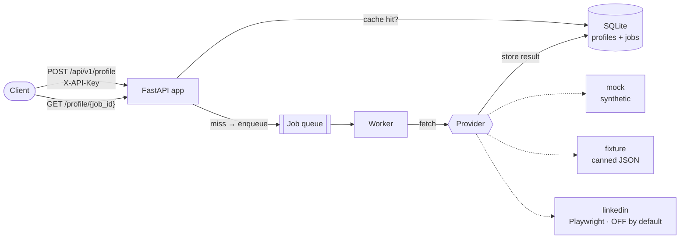

# LinkedIn Profile API

A hosted HTTPS API that accepts a LinkedIn profile URL and returns structured JSON —
name, headline, location, about, experience, education, skills, certifications,
languages, and image URLs.

It is built around a **pluggable data-provider architecture**. Out of the box it runs
on synthetic/fixture data, so the whole thing is testable, demoable, and deployable
**without touching LinkedIn or risking an account**. A real browser-automation scraper
is included as an **optional, off-by-default** provider — see
[Known Limitations / ToS](#known-limitations--tos) before you even think about enabling it.

> **This is a portfolio / demonstration project, not a production scraping service.**
> Scraping LinkedIn violates its User Agreement and carries a real risk of account
> suspension. The default configuration deliberately does not touch LinkedIn.

---

## Table of contents

- [What it does](#what-it-does)
- [Architecture](#architecture)
- [The provider model](#the-provider-model)
- [Setup](#setup)
- [Configuration](#configuration)
- [API reference](#api-reference)
- [Response schema](#response-schema)
- [Testing](#testing)
- [The optional LinkedIn scraper](#the-optional-linkedin-scraper)
- [Known Limitations / ToS](#known-limitations--tos)
- [Project layout](#project-layout)

---

## What it does

Submit a profile URL and get structured JSON back. Because scraping is inherently
slow and rate-limited, the API is **asynchronous**:

1. `POST /api/v1/profile` with a URL. If a fresh copy is cached you get the data
   immediately (`200`); otherwise a job is queued and you get a `job_id` (`202`).
2. `GET /api/v1/profile/{job_id}` to poll until the job is `done` (or `error`).

Every result is **cached in SQLite** keyed by the canonical profile URL, so a profile
already fetched within the TTL window (default 7 days) is never re-fetched. All access
is guarded by an `X-API-Key` header.

Key properties:

- **Predictable JSON shape** — unavailable fields are `null` (scalars) or `[]` (sections),
  never missing. Clients can rely on the contract in [`docs/schema.json`](docs/schema.json).
- **Graceful degradation** — a private or partial profile returns whatever was available
  plus a `warnings` array explaining what was missing, rather than failing outright.
- **No secrets in git** — configuration is via `.env`; only `.env.example` is committed.

## Architecture



**Request flow**

1. The URL is normalized and validated (`app/urls.py`) — anything that isn't a
   `linkedin.com/in/<slug>` URL is rejected with `422`.
2. The cache is checked (`app/cache.py`). A fresh hit short-circuits the queue.
3. On a miss, a job row is created and enqueued (`app/jobs.py`, `app/db.py`).
4. A worker claims the job, calls the selected **provider**, applies retries with
   exponential backoff for transient failures, stores the result, and marks the job done.
5. The worker runs **inline** inside the API process by default (great for a demo), or
   as a **standalone process** (`app/worker.py`) that atomically claims queued jobs from
   the DB — so you can scale it out without code changes.

Cross-cutting: structured JSON logging with a per-request `request_id`
(`app/logging_config.py`), constant-time API-key comparison (`app/auth.py`), and a
courtesy randomized delay between remote actions.

## The provider model

The core of the design is that the app depends on a **`ProfileProvider` protocol**
(`app/providers/base.py`), never on any specific data source:

```python
class ProfileProvider(Protocol):
    name: str
    async def fetch(self, url: str) -> ProfileResult: ...
    async def healthcheck(self) -> ProviderHealth: ...
```

`get_provider()` picks the implementation from the `PROVIDER` env var:

| `PROVIDER` | Source | Needs network / account? | Use for |
|------------|--------|--------------------------|---------|
| `mock` *(default)* | Deterministic synthetic data seeded from the URL slug | No | Local dev, demos, load-testing the API |
| `fixture` | Canned JSON in `tests/fixtures/profiles/` | No | The automated test suite |
| `linkedin` | Real Playwright + Chromium scraper | **Yes — and violates ToS** | Manual, at-your-own-risk experiments only |

This inversion is what makes the API **fully testable and CI-safe without ever hitting
LinkedIn**. The heavy scraper dependencies (Playwright, BeautifulSoup) are an optional
install extra and are imported lazily, so the core app and the test suite don't require
a browser engine at all.

## Setup

**Requirements:** Python 3.11+. (Optional scraper: also needs Playwright + Chromium.)

### 1. Install

```bash
git clone <your-fork-url> linkedin-profile-api
cd linkedin-profile-api
python -m venv .venv && . .venv/bin/activate      # Windows: .venv\Scripts\Activate.ps1
pip install -e ".[dev]"                            # core app + test/lint tooling
```

> There's a `Makefile` with shortcuts (`make install`, `make run`, `make test`, …).
> On Windows without `make`, run the underlying commands shown in each section.

### 2. Configure

```bash
cp .env.example .env                               # Windows: copy .env.example .env
python -c "import secrets; print(secrets.token_urlsafe(32))"   # generate an API key
```

Edit `.env` and set `API_KEY`. The defaults (`PROVIDER=mock`, SQLite) work immediately;
no LinkedIn credentials are needed.

### 3. Run

```bash
uvicorn app.main:app --reload          # or: make run  /  linkedin-api
```

Open <http://localhost:8000/docs> for interactive Swagger docs, or:

```bash
curl -s localhost:8000/health | jq
```

### Run with Docker

The default image builds the **core app only** (no browser engine):

```bash
docker compose up --build
```

SQLite is persisted to a named volume. Secrets are read from `.env` when present.

## Configuration

All configuration is via environment variables (see [`.env.example`](.env.example)).

| Variable | Default | Description |
|----------|---------|-------------|
| `API_KEY` | — | **Required.** Value clients must send in the `X-API-Key` header. |
| `PROVIDER` | `mock` | Data source: `mock` \| `fixture` \| `linkedin`. |
| `DATABASE_URL` | `sqlite:///./data/profiles.db` | SQLite path (a Postgres URL is accepted by config but the SQLite backend is what ships). |
| `CACHE_TTL_SECONDS` | `604800` (7 days) | Don't re-fetch a profile cached more recently than this. |
| `LOG_LEVEL` | `INFO` | `DEBUG` \| `INFO` \| `WARNING` \| `ERROR`. |
| `RUN_INLINE_WORKER` | `true` | Run the worker inside the API process. Set `false` to use a standalone `app.worker`. |
| `FETCH_MIN_DELAY_SECONDS` | `1.5` | Lower bound of the courtesy delay between remote actions. |
| `FETCH_MAX_DELAY_SECONDS` | `4.0` | Upper bound of the courtesy delay. |
| `LI_EMAIL` / `LI_PASSWORD` | — | LinkedIn credentials — **only** read when `PROVIDER=linkedin`. Use a throwaway account. |
| `SESSION_STATE_PATH` | `./session/state.json` | Where the authenticated browser session is stored. |
| `LINKEDIN_HEADLESS` | `true` | Whether the scraper runs headless. |

Secrets (`API_KEY`, `LI_*`) live only in `.env`, which is git-ignored from the first commit.

## API reference

All `/api/v1/*` endpoints require the `X-API-Key` header. `/health` and `/` are public.

### `GET /health`

Liveness plus provider readiness. No auth.

```json
{
  "status": "ok",
  "version": "0.1.0",
  "provider": { "provider": "mock", "ok": true, "detail": null }
}
```

### `POST /api/v1/profile`

Submit a profile URL. Body: `{ "url": "https://www.linkedin.com/in/<slug>" }`.

- **`202 Accepted`** — job queued (cache miss):

  ```json
  { "job_id": "a1b2c3…", "status": "queued", "url": "https://www.linkedin.com/in/jane-doe", "cached": false, "data": null }
  ```

- **`200 OK`** — served from cache (`cached: true`, `data` populated, `status: "done"`).
- **`401`** — missing/invalid API key. **`422`** — not a valid LinkedIn profile URL.

```bash
curl -s -X POST localhost:8000/api/v1/profile \
  -H "X-API-Key: $API_KEY" -H "Content-Type: application/json" \
  -d '{"url":"https://www.linkedin.com/in/jane-doe"}'
```

### `GET /api/v1/profile/{job_id}`

Poll a job.

```json
{
  "job_id": "a1b2c3…",
  "status": "done",
  "url": "https://www.linkedin.com/in/jane-doe",
  "data": { "url": "…", "source": "mock", "scraped_at": "…", "profile": { … }, "warnings": [] },
  "error": null
}
```

`status` is one of `queued` \| `running` \| `done` \| `error`. On `error`, `error` holds
the message and `data` is `null`. Unknown `job_id` → `404`.

## Response schema

The full JSON Schema of every response object is committed at
[`docs/schema.json`](docs/schema.json) and generated directly from the Pydantic models
(`app/schemas.py`) — regenerate it with `python -m scripts.dump_schema`.

Abridged shape of the `profile` object inside a result:

```jsonc
{
  "name": "Jane Doe",
  "headline": "Staff Engineer at Acme",
  "location": "London, England, United Kingdom",
  "about": "…",
  "profile_photo_url": "https://…",
  "banner_photo_url": "https://…",
  "experience": [
    { "title": "Staff Engineer", "company": "Acme", "employment_type": "Full-time",
      "location": "London", "start_date": "Jan 2021", "end_date": null,
      "is_current": true, "description": "…" }
  ],
  "education":      [ { "school": "…", "degree": "…", "field_of_study": "…", "start_date": "…", "end_date": "…" } ],
  "skills":         [ { "name": "Python", "endorsement_count": 42 } ],
  "certifications": [ { "name": "…", "issuer": "…", "credential_url": "…" } ],
  "languages":      [ { "name": "English", "proficiency": "Native or bilingual" } ]
}
```

The result envelope wraps it with `url`, `source` (which provider produced it),
`scraped_at` (UTC), and a `warnings` array.

## Testing

The suite runs entirely offline against the `fixture` provider — no credentials, no
network, no live LinkedIn — so it's safe for CI.

```bash
pytest            # or: make test
ruff check .      # lint
```

Coverage includes URL normalization, the HTML parsers (against saved HTML fixtures),
the mock/fixture providers, the TTL cache, and the full API lifecycle (auth, validation,
enqueue → poll → done, cache hits, and error handling) exercised through the ASGI app
with the inline worker.

## The optional LinkedIn scraper

> Read [Known Limitations / ToS](#known-limitations--tos) first. Enabling this uses a
> real logged-in session and can get the account banned.

If you understand and accept the risk (e.g. for a private experiment with a throwaway
account you're willing to lose):

```bash
pip install -e ".[scraper]"                 # or: make install-scraper
python -m playwright install chromium
python -m scripts.login                     # headed browser; log in + pass 2FA manually
# set PROVIDER=linkedin and LI_EMAIL / LI_PASSWORD in .env
python -m scripts.smoke_live "https://www.linkedin.com/in/<slug>"
```

`scripts/login.py` performs an interactive, **headed** login once and saves the session
state to `SESSION_STATE_PATH`; the scraper reuses that session. The CSS selectors in
`app/providers/linkedin_parsers.py` are **illustrative** — LinkedIn's markup is
obfuscated and changes frequently, so expect to adjust them, and expect fields to come
back empty (each result says so in `warnings`).

**Deliberate non-goals:** this project applies only a polite, randomized request delay.
It does **not** implement, and will not implement, anti-bot-detection, fingerprint
evasion, CAPTCHA solving, or proxy rotation. Those exist to defeat a platform's access
controls; that is out of scope here by design.

## Known Limitations / ToS

**Please read this.**

- **Scraping LinkedIn violates the LinkedIn User Agreement.** Using the `linkedin`
  provider automates a logged-in session, which is against LinkedIn's terms and **can
  result in permanent suspension of the account used.** Never use a personal account.
  This repository is a **portfolio/demo project, not a production scraping service.**
- **Default is safe.** With `PROVIDER=mock` (or `fixture`) the API never contacts
  LinkedIn and carries none of this risk. That's the intended way to run and evaluate it.
- **No anti-detection.** As above, only courtesy rate-limiting is implemented. There is
  no attempt to evade bot detection.
- **Fragile selectors.** LinkedIn's HTML is dynamic and obfuscated. The scraper's
  parsers are best-effort and will break; graceful degradation returns partial data with
  `warnings` rather than crashing.
- **Personal data / GDPR.** LinkedIn profiles are personal data. Collecting, storing, or
  processing it may be regulated (e.g. GDPR/CCPA) and may require a lawful basis and the
  individual's awareness. The cache stores fetched profiles in SQLite; treat that data
  accordingly, secure it, and delete it when it's no longer needed. **You are the data
  controller for anything you scrape — comply with the law in your jurisdiction.**
- **Rate limits & scale.** The single-session, single-worker design is intentional; this
  is not built to scrape at scale, and doing so would compound both the ToS and legal risk.

## Project layout

```
app/
  main.py              FastAPI app, routes, lifespan, request logging
  config.py            Settings (pydantic-settings) from .env
  urls.py              LinkedIn URL validation + canonicalization
  schemas.py           Pydantic models — the API contract
  auth.py              X-API-Key dependency (constant-time compare)
  db.py                aiosqlite: profiles + jobs tables, atomic job claim
  cache.py             TTL freshness check + store/lookup
  jobs.py              In-process queue, submit(), retries, job processing
  worker.py            Standalone worker entry point
  logging_config.py    Structured JSON logging with request context
  cli.py               `python -m app.cli <url>` one-shot fetch
  providers/
    base.py            ProfileProvider protocol + error hierarchy
    mock.py            Deterministic synthetic provider (default)
    fixture.py         Canned-JSON provider (tests)
    linkedin.py        Optional Playwright scraper (off by default)
    linkedin_parsers.py  Pure HTML → dict parsers (browser-free, unit-tested)
scripts/               login, live smoke test, fixture + schema generators
tests/                 offline suite + HTML/JSON fixtures
docs/schema.json       generated response schema
Dockerfile, docker-compose.yml, Makefile, pyproject.toml, .env.example
```

---

## License

MIT — see [`LICENSE`](LICENSE). (Update the copyright holder placeholder to your name.)

*Built as a demonstration of API design, async job processing, and a testable,
provider-abstracted architecture — not as a tool to scrape LinkedIn at scale.*
